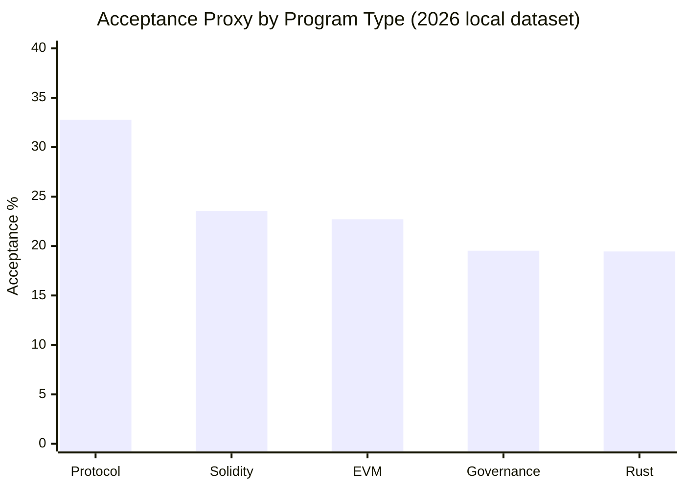
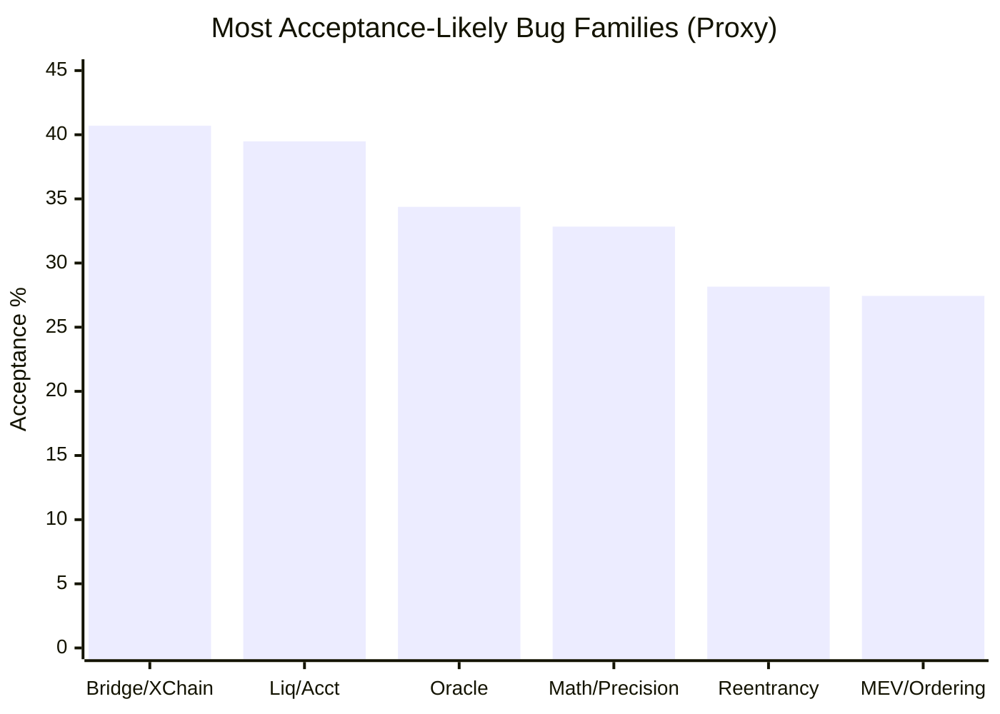

# All Smartcontract Audit Reports

Central repository for smart contract audit research outputs, datasets, scripts, and a 2026 bug bounty playbook.

## Repository Layout

| Path | Purpose |
|---|---|
| `research_output/` | Main research dataset, summaries, schemas, and bug checklists |
| `research_output/charts/` | Generated chart artifacts |
| `research_output/scripts/` | Dataset and chart generation scripts |
| `README.md` | Main playbook and analysis |

> Data snapshot: **February 28, 2026** (from this repo's `research_output` dataset)

I built this guide from our own audit corpus and acceptance-proxy analysis, then mapped it to current 2026 bug bounty and competition workflows.

Note: `research_output/cache/` is intentionally excluded from version control to keep the repository lightweight.

## 1) What the data says (before opinions)

### Corpus scale

| Metric | Value |
|---|---:|
| Public audit links indexed | 5,358 |
| Code4rena judged reports analyzed | 402 |
| Reports with High/Medium findings | 373 (92.79%) |

### Severity distribution from judged Code4rena reports

| Bucket | Count | Share |
|---|---:|---:|
| Medium | 21,426 | 39.23% |
| High | 8,748 | 16.02% |
| Low | 6,450 | 11.81% |
| Non-critical | 6,582 | 12.05% |
| Gas | 11,406 | 20.89% |

### Program-type acceptance proxy (HM signal / bug signal)



Interpretation: **Protocol bugs are the strongest lane** in this dataset for accepted high/medium outcomes.

## 2) Which bugs I focus on first in 2026

### Top acceptance-proxy bug families (signal >= 50 reports)



| Priority | Bug family | Acceptance proxy | HM signal | Why this matters |
|---|---|---:|---:|---|
| P1 | Bridge/Cross-Chain Validation | 40.70% | 35 | Exploitable auth/proof mistakes are still high impact and accepted. |
| P1 | Liquidation/Accounting Invariants | 39.48% | 122 | Deep logic/accounting drift repeatedly yields real H/M findings. |
| P1 | Oracle Manipulation | 34.38% | 66 | Thin-liquidity + pricing assumptions remain exploitable. |
| P2 | Math/Precision | 32.84% | 132 | High frequency and high acceptance in judged findings. |
| P2 | Reentrancy | 28.16% | 69 | Still relevant when callbacks/state-ordering are subtle. |
| P2 | MEV/Ordering Dependence | 27.44% | 73 | Many protocols break under adversarial ordering. |
| P3 | Permit/Approval Abuse | 27.16% | 88 | Signature/allowance context errors are common and practical. |
| P3 | Unsafe Delegatecall / Upgradeability | 24.93% | 91 | Upgrade and proxy surfaces still produce accepted issues. |

Note: These are **proxy rates** from keyword signals in judged C4 reports (`research_output/checklist_bug_acceptance_by_program.csv`), not a perfect ground-truth taxonomy label for every finding.

## 3) Where I hunt in 2026

| Track | Platforms | Why |
|---|---|---|
| Competitive audits | [Code4rena](https://docs.code4rena.com/), [Sherlock](https://docs.sherlock.xyz/), [Cantina](https://cantina.xyz/opportunities/competitions) | Fast learning loop, public judging, repeatable reputation-building. |
| Live bug bounties | [Immunefi](https://immunefi.com/), [Hats Finance](https://docs.hats.finance/) | Real-world production targets and direct payout paths. |

My sequence:
1. Start in competitions for 6-8 weeks (faster feedback and public benchmark).
2. Build a reusable checklist + automation stack.
3. Move to live bounty programs with strong scope and mature triage.

## 4) People and feeds I follow daily

### Core program + audit ecosystem
- [@code4rena](https://x.com/code4rena)
- [@sherlockdefi](https://x.com/sherlockdefi)
- [@cantinaxyz](https://x.com/cantinaxyz)
- [@solodit](https://x.com/solodit)
- [@openzeppelin](https://x.com/openzeppelin)
- [@TrailOfBits](https://x.com/TrailOfBits)
- [@NethermindEth](https://x.com/NethermindEth)

### Incident intel and fast exploit signal
- [@CertiKAlert](https://x.com/CertiKAlert)
- [@BlockSecTeam](https://x.com/BlockSecTeam)
- [@peckshield](https://x.com/peckshield)
- [@RektHQ](https://x.com/RektHQ)
- [@zachxbt](https://x.com/zachxbt)

### Researchers repeatedly seen in our incident-linked dataset
- [@tayvano_](https://x.com/tayvano_)
- [@steipete](https://x.com/steipete)
- [@pashov](https://x.com/pashov)

## 5) Automation tools I actually use

### Core stack
- `Foundry` for tests, invariants, and fast reproduction.
- `Slither` for static analysis and anti-pattern sweeps.
- `Echidna` for property-based fuzzing.
- `Medusa` for advanced fuzz campaigns (optional when scope justifies).
- Your local AI ruleset: `research_output/ai_snort_rules.yaml`.

### Daily pipeline (minimal, strong)

```bash
# 1) Compile + unit tests
forge test -vvv

# 2) Static sweep
slither . --checklist --json slither-report.json

# 3) Invariant tests
forge test --match-test invariant -vvv

# 4) Property fuzzing (when harness is ready)
echidna . --contract InvariantHarness --config echidna.yaml
```

### Fast grep prefilter from our AI snort note

```bash
rg -n "ecrecover|ECDSA\.recover|permit|DOMAIN_SEPARATOR|nonce|delegatecall|initializer|oracle|twap|timelock|proposal|flash loan" src test
```

## 6) How I use AI without lowering quality

I use AI as a **force multiplier**, not as an autonomous auditor.

### What AI does well for me
1. Turn codebase + docs into a threat model draft quickly.
2. Suggest exploit hypotheses from suspicious state transitions.
3. Convert rough notes into clean, structured report drafts.
4. Generate candidate invariant tests and edge-case matrices.

### What I never outsource to AI
1. Final exploit feasibility judgment.
2. Severity calibration against program rules.
3. Reproduction and proof-of-concept validation.
4. Final wording of impact claims.

### Prompt format I use

```text
You are assisting a smart-contract auditor.
Target: <protocol name>
Files: <paths>
Focus bug family: <e.g., liquidation/accounting invariants>
Return strictly:
1) trigger_evidence
2) exploit_path
3) required_preconditions
4) confidence(low/medium/high)
5) minimal_fix
6) one invariant test idea
Do not guess if evidence is weak; mark as suspect.
```

## 7) First-person professional writeup template

```md
# [High/Medium] <Clear Bug Title>

## Summary
I identified a vulnerability in `<contract/function>` that allows `<attacker>` to `<impact>` by `<core mechanism>`.

## Root Cause
The issue exists because `<state/authorization/accounting assumption>` is not enforced when `<trigger condition>`.

## Exploit Path
1. Attacker `<step 1>`
2. Protocol `<incorrect state transition>`
3. Attacker `<value extraction / privilege gain>`

## Impact
- Technical: `<what breaks>`
- Economic: `<loss / insolvency / unfair liquidation>`
- Scope: `<which users / pools / chains>`

## Proof of Concept
`<concise reproducible PoC steps or test reference>`

## Recommended Fix
I recommend `<minimal patch>` and adding `<invariant/property test>` to prevent regression.

## References
- `<code lines>`
- `<spec/docs>`
```

## 8) 30-day execution plan

1. Week 1: Pick one protocol vertical (lending/perps/bridge), set up full local automation stack.
2. Week 2: Run 3 competition codebases with the same checklist (do not change process each time).
3. Week 3: Submit at least 5 deeply validated reports (quality over volume).
4. Week 4: Build personal "missed-findings" log and retrain prompts + invariants from mistakes.

## 9) References

### Internal research files (this repo)
- `research_output/smart-contract-audit-research.md`
- `research_output/checklist_bug_acceptance_by_program.csv`
- `research_output/checklist_program_acceptance_summary.csv`
- `research_output/code4rena_severity_counts.csv`
- `research_output/twitter_audit_and_incident_handles.txt`
- `research_output/twitter_security_writeups_from_rekt.csv`
- `research_output/ai_snort_note.md`
- `research_output/ai_snort_rules.yaml`

### External official sources
- Code4rena docs: https://docs.code4rena.com/
- Sherlock docs: https://docs.sherlock.xyz/
- Cantina competitions: https://cantina.xyz/opportunities/competitions
- Immunefi: https://immunefi.com/
- Hats Finance docs: https://docs.hats.finance/
- Foundry Book (invariant testing): https://book.getfoundry.sh/forge/invariant-testing
- Slither: https://github.com/crytic/slither
- Echidna: https://github.com/crytic/echidna
- Medusa: https://github.com/crytic/medusa
